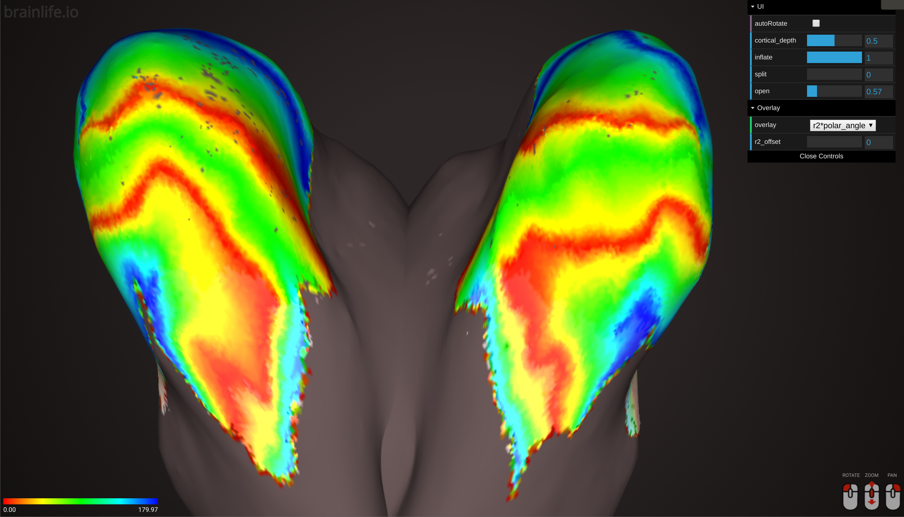

# Population Receptive Field (PRF) Surface Viewer

HTML5/threejs based PRF Surface Viewer. It takes series of VTK files converted from freesurfer surface data (/surf) and pRF output .nii.gz

### Authors
- [Soichi Hayashi](hayashis@iu.edu)
- [David Hunt](davhunt@iu.edu)

### Project Director
- [Franco Pestilli](frakkopesto@gmail.com)

### Funding Acknowledgement
brainlife.io is publicly funded and for the sustainability of the project it is helpful to Acknowledge the use of the platform. We kindly ask that you acknowledge the funding below in your publications and code reusing this code.

#### MIT Copyright (c) 2020 brainlife.io The University of Texas at Austin and Indiana University

